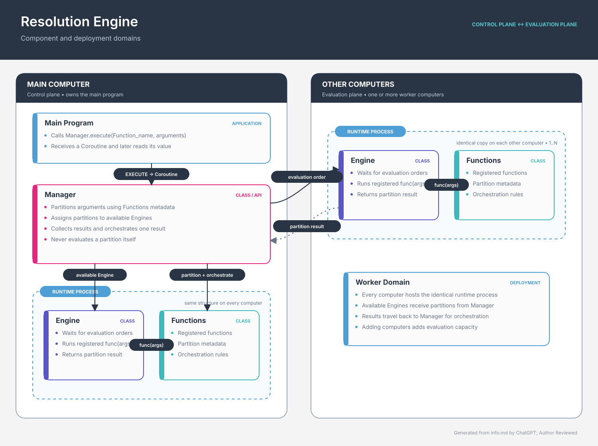

# mpi.c

`mpi.c` is an experimental distributed-computing project that explores how a
programmer-defined function can be split into smaller functions, sent to
independent resolution engines, evaluated, and combined into one result.

Despite the repository name, the active prototype is written in Python. The
original C/C++ MPI-style simulator and an earlier Python task-runner prototype
are retained under [`deprecated/`](deprecated/) for historical reference.

> **Project status:** experimental and under active design. The current demo
> runs engine subprocesses on one machine and requires the user to partition,
> place, evaluate, and orchestrate work explicitly. It is not an MPI
> implementation or a production-ready distributed runtime.

## Current capabilities

The active prototype can:

- start independent Python engine subprocesses;
- communicate with each engine over localhost TCP;
- frame and exchange JSON messages with a 16 MiB message limit;
- create a function object and split it into exactly two partitions;
- transfer serialized partitions to selected engines;
- evaluate transferred partitions inside those engine processes;
- return partial results and combine them in the main process; and
- expose the full workflow through an interactive command-line demo.

The included `Sum` function is the reference implementation of the
partition/evaluate/orchestrate contract.

## How it works

The current execution flow is:

1. The CLI creates one or more `Engine` objects.
2. Each `Engine` starts a persistent Python subprocess and connects to it over
   TCP.
3. `DemoSystem` creates a `Function` and asks it to produce two child
   functions.
4. The user transfers each child function to an engine.
5. Each engine deserializes and evaluates its assigned function.
6. The main process receives the partial results and asks the original
   function to orchestrate them into one result.



The diagram represents the direction of the proposed architecture. The active
demo implements a smaller, local subset of it; in particular, automatic
analysis, multi-computer scheduling, versioned memory, caching, and recovery
are roadmap items.

## Requirements

- Python 3.10 or newer
- A host that permits localhost TCP sockets and subprocess creation
- `pytest` only if you want to run the tests

The active demo uses only the Python standard library at runtime.

## Quick start

From the repository root, start the interactive shell:

```bash
python3 src/app.py
```

Type `help` to list the available commands and `exit` to stop the demo. The
application closes all engine subprocesses when the session ends.

### Example session

Object and process IDs are generated at runtime. In the commands below,
replace the uppercase placeholders with the IDs printed by the preceding
commands.

```text
create -p 2
create -fn Sum -params [1,2,3,4]
partition -id TOTAL_ID
transfer -id LEFT_ID PROCESS_1_ID
transfer -id RIGHT_ID PROCESS_2_ID
eval -id LEFT_ID
eval -id RIGHT_ID
orchestrate -id TOTAL_ID
list processes
exit
```

`Sum.eval()` currently includes an artificial delay so that process activity
is easy to observe. The interactive `eval` command is blocking, so this demo
shows process isolation and data movement rather than measuring parallel
speedup.

## CLI reference

| Command                                      | Purpose                                                             |
| -------------------------------------------- | ------------------------------------------------------------------- |
| `create -p NUMBER`                         | Start the requested number of engine subprocesses.                  |
| `create -fn CLASS_NAME -params PARAMETERS` | Create a function from a Python literal such as a list of integers. |
| `partition -id OBJECT_ID`                  | Split a function into two child function objects.                   |
| `transfer -id OBJECT_ID PROCESS_ID`        | Serialize an object and assign it to an engine.                     |
| `eval -id OBJECT_ID`                       | Evaluate a transferred object on its assigned engine.               |
| `orchestrate -id OBJECT_ID`                | Combine the evaluated children of a partitioned object.             |
| `list processes`                           | Show engine health, assigned objects, and evaluation state.         |
| `help`                                     | Print the command list.                                             |
| `exit` or `quit`                         | Close the engines and exit.                                         |

Invalid commands and recoverable operation failures are printed as warnings;
the shell remains open for the next command.

## Core modules

### `src/app.py`

Provides the CLI and `DemoSystem`, the session-level coordinator. It owns the
object registry, process registry, partition relationships, and
object-to-engine assignments.

### `src/engine.py`

Implements command parsing, the parent-side `Engine` handle, and the child
process server. Each engine keeps transferred functions in memory and responds
to transfer, evaluation, and shutdown requests.

### `src/functions.py`

Defines the abstract `Function` contract and the included `Sum`
implementation. A distributable function is responsible for:

- `partition()` — create exactly two child functions;
- `eval()` — compute and store its result;
- `orchestrate()` — combine evaluated child results;
- `serialize()` — produce a JSON-compatible representation; and
- `deserialize()` — restore the function from that representation.

New function classes must also be added to `FUNCTION_CLASSES` so engine
processes can deserialize them safely.

To add another distributable function:

1. Define a `Function` subclass in `src/functions.py`.
2. Implement all five contract methods listed above.
3. Keep its serialized state JSON-compatible.
4. Register the class in `FUNCTION_CLASSES`.
5. Add partitioning, evaluation, orchestration, and serialization tests.

### `src/network.py`

Provides the TCP transport. Messages are JSON objects prefixed with a
four-byte, network-order payload length. The transport rejects non-object
payloads and messages larger than 16 MiB.

## Project structure

```text
.
├── src/                         Active resolution-engine prototype
│   ├── app.py                   Interactive CLI and demo coordinator
│   ├── engine.py                Engine subprocess lifecycle and protocol
│   ├── functions.py             Function contract and Sum implementation
│   └── network.py               Length-prefixed JSON-over-TCP transport
├── tests/test_python_only/      Tests for active and earlier prototypes
├── diagrams/                    Component and sequence diagrams
├── documentation/               Design notes and future architecture
├── tools/                       Diagram-generation utilities
├── task_division_prototype/     Earlier task-division experiment
├── deprecated/                  Archived C/C++ and Python implementations
├── reports/                     Historical test reports
└── agents/                      Repository-specific agent role notes
└── temp_src/					 Sandbox environment for understanding src/
```

## Testing

Run the tests for the active function and demo modules with:

```bash
python3 -m pytest \
  tests/test_python_only/test_functions.py \
  tests/test_python_only/test_demo_system.py
```

The integration tests open localhost sockets and create subprocesses, so they
may fail in restricted or sandboxed environments. At this snapshot, the focused
suite also exposes an unresolved `Sum.orchestrate()` failure, so the command is
a development check rather than a passing release gate. The wider test
directory contains historical chaos tests from an earlier prototype and is not
yet a single clean test suite for the active implementation.

## Design documents

- [`documentation/FUTUREWORKS.md`](documentation/FUTUREWORKS.md) describes the
  proposed persistent-engine architecture, evaluation API, versioned memory,
  memoization, partitioning contracts, recovery, and implementation roadmap.
- [`documentation/GELECEKISLER.md`](documentation/GELECEKISLER.md) is the
  Turkish version of the future architecture plan.
- [`diagrams/component_diagram.svg`](diagrams/component_diagram.svg) shows the
  proposed components and deployment boundaries.
- [`diagrams/sequence_diagram.svg`](diagrams/sequence_diagram.svg) shows the
  proposed evaluation sequence.
- [`documentation/DESCRIPTION.md`](documentation/DESCRIPTION.md) documents the
  archived C/C++ MPI-style simulator rather than the active Python prototype.

## Current limitations

- Engines run as local subprocesses; remote hosts are not supported yet.
- Partitioning and engine placement are manual and fixed to two partitions.
- Evaluation requests are synchronous from the CLI.
- Only explicitly registered, JSON-serializable function classes can cross the
  process boundary.
- The current transport has no authentication or encryption and is intended
  only for local experimentation.
- Automatic scheduling, cancellation propagation, state versioning,
  memoization, retries, and recovery remain future work.
- The repository is being reorganized, so some tests, reports, and documents
  still describe archived prototypes.

## License

This project is available under the [MIT License](LICENSE).
